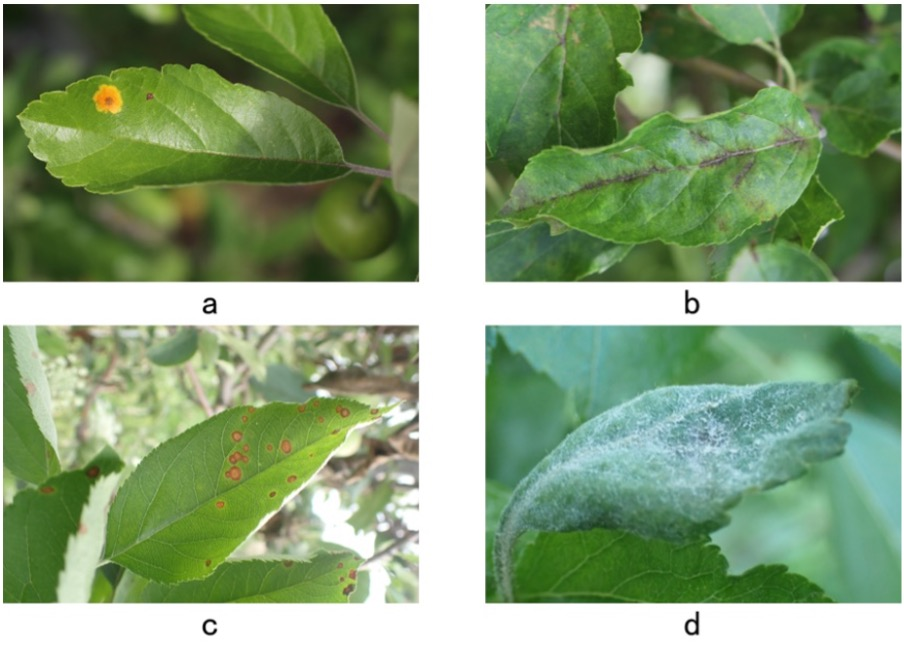
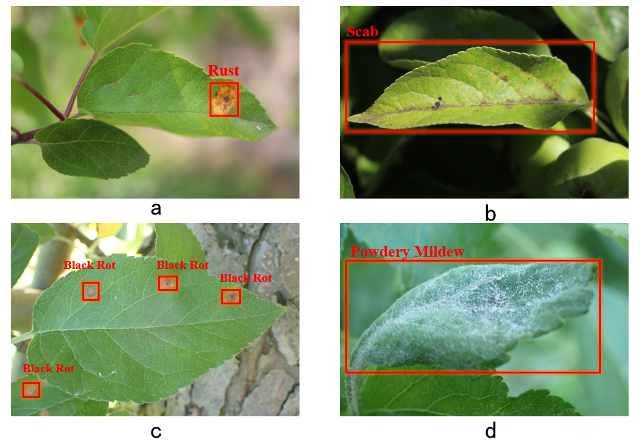
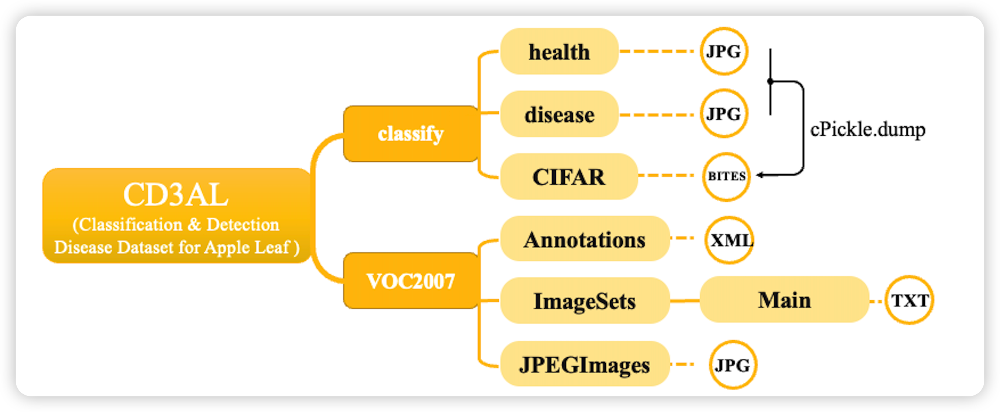

# Classification & Detection Disease Dataset for Apple Leaf, CD3AL

> This dataset is collected for undergraduate bachelor's degree thesis, and its detection labels are annotated by the author, and the final interpretation right belongs to the author.

## 1 Introduction

The acquisition of high-quality images is one of the main focuses of research in image-based plant disease detection. Due to the characteristics of convolutional neural networks themselves, when using computer vision as a tool for accurate disease identification, all potential symptoms must be considered in the image dataset, and the size and quality of the training dataset directly affect the accuracy and generalization of the model. In this paper, the **Classification & Detection Disease Dataset for Apple Leaf (CD3AL)** is constructed to cover both detection and classification tasks in order to train a better quality model. In order to simulate the user's scenario in a real environment, this paper collects a large number of apple leaf disease datasets collected under different conditions, and selects **rust, scab, powdery mildew and black rot** as the research objects through analysis and comparison, pre-processes the original dataset to produce the required classification and detection dataset, and finally applies common image enhancement methods to the dataset for data enhancement.

The dataset is divided into two parts: **detection and classification**

Detection：Contains **12,263** images of diseased apple leaves and GT annotations for each image

Classification：Contains **12,265** images of diseased and **6,785** images of healthy apple leaves

After **data enhancement**, the number of images in the detection dataset is **21668** and the number of images in the classification dataset is **24530**

***Note***: The detection dataset and the classification dataset share most of the decease images

----

基于图像的植物病害检测研究中，如何获取高质量的图像是研究的重点之一。由于卷积神经网络本身的特点，当使用计算机视觉作为精确疾病识别的工具时，必须在图像数据集中考虑所有潜在的症状，训练数据集的大小和质量直接影响到模型的准确率和泛化性。本文为了训练得到更优质的模型，构建涵盖检测和分类任务的苹果叶片病害数据集 **Classification & Detection Disease Dataset for Apple Leaf, CD3AL**。为了模拟真实环境下用户的使用场景，本文收集了大量在不同条件下采集到的苹果叶片病害数据集，通过分析比对后选择**锈病、黑星病、白粉病和黑腐病**作为研究对象，对原始数据集进行预处理后制作所需的分类和检测数据集，最后再应用常见的图像增广方法对数据集进行数据增强。

数据集分为**检测**和**分类**两个部分：

对于检测数据：包含**12263**张患病苹果叶片图像以及对于每一张图像的GT注释

对于分类数据：包含**12265**张患病以及**6785**张健康苹果叶片图像

数据增强后，检测数据集图像数量为**21668**张，分类数据集图像数量为**24530**张

***注意***：检测数据集和分类数据集共用大部分患病图像

## 2 Data Collection

Data from three publicly available apple leaf disease datasets, **FGVC7, FGVC8 and Plant-Village**. 

**FGVC7** and **FGVC8** are from the Kaggle Plant Pathology Challenge 2020 and 2021, respectively, as part of the Fine-Grained Visual Categorization (FGVC) on Computer Vision and Pattern Recognition (CVPR). The data are from the work of Ranjita Thapa ^[1]^ et al.

> [1]   Thapa R, Snavely N, Belongie S, et al. The Plant Pathology 2020 challenge dataset to classify foliar disease of apples[J]. 2020.

The **Plant-Village** is from the 2018 AI Challenger crop disease detection competition, courtesy of plantvillage.org, and is derived from the work of David. P. Hughes ^[2]^ et al.

> [2]   Hughes D, Salathé M. An open access repository of images on plant health to enable the development of mobile disease diagnostics[J]. arXiv preprint arXiv:1511.08060, 2015.

## 3 Data Annotation

### Detection

The annotation process uses the Labelimg labeling tool to manually box the area to be labeled and generates an xml file with the same name containing the labeling box information, which is stored in  `./VOC2007/Annotations.`

Due to the differences in leaf disease traits, two different annotation methods are used in this paper.

For the images of **rust** and **black rot**, the spots are round with clear borders and each spot has an annotation box. The location of the spots was directly selected so that the annotation box was tangential to the edge of the spot, and small and dense spots were marked with one annotation box.

For the images of **scab** and **powdery mildew**, the disease spots are mostly dip-like, without obvious disease location and obvious boundary, so it is impossible to select the disease spots accurately by annotation box. If the disease spot areas are selected by manual discrimination, different judgments are easy to occur in the annotation process, which is not conducive to the model learning uniform features. Therefore, the whole diseased leaf was annotated in this part of the data.

### Classification

The **Classification** part is not specifically annotated. The data were divided into two categories, healthy and disease, and placed under different folders.  To facilitate loading the data, we processed the data in the format of the CIFAR dataset. To ensure that the images do not lose too much detail, we organize the data at a higher resolution, including `140x140` and `128x128`

## 3 Data Augmentation

Common data enhancement operations are applied to the data in CD3AL, including Gaussian noise, image geometry transformations, etc. 

For the detection dataset it is necessary to change the annotation file at the same time as the transformation of the images, and then save the new images and annotations corresponding to one by one. 

In addition, considering the possible negative impact of uneven number of images of different categories in the dataset on the training process, this paper does not simply apply data enhancement operations to all data, but ensures the **same proportion of each category** after enhancement.

## 4 Usage

#### (1) Download the dataset

***!!! CD3AL is completely open access !!!***

If you need the CD3AL Dataset for academic purposes, please briefly describe your request, then send it to ***[zhaopancheng@mail.nankai.edu.cn](mailto:zhaopancheng@mail.nankai.edu.cn)***. I will process your application as soon as possible. It would be better if the email used was from your educational institution.

If someone needs this dataset, I would be very pleased!

#### (2) Data Structure

the data structure is as below

The data is stored separately, so you can download all of it or any part you need.

The data augmentation folder is stored separately, so you only need to copy its contents to the corresponding path in `./VOC2007` when using it.
